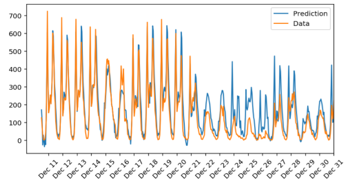
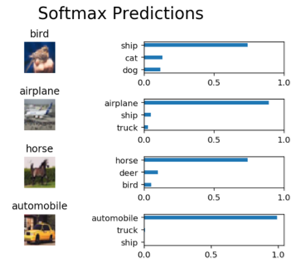
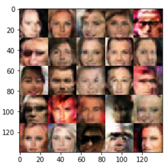

# DeepLearning Exercise Contents

### 环境
- python 3.5
- tensorflow 1.0

### P1  [first neural network - 预测每日自行车租赁乘客量](https://github.com/ljh20/DL_exercise/tree/master/first_neural_network)
> ##### 数据集
> - 2011年1月1日至2012年12月31日期间每一小时的乘客人数
> ##### 主要算法
> - 简单的神经网络
> ##### 结果
> -  

### P2  Image Classification - 图像分类器

> ##### 数据集
> - [CIFAR-10 dataset](https://www.cs.toronto.edu/~kriz/cifar.html)
> ##### 主要算法
> - 简单的CNN
> ##### 结果
> - Testing Accuracy: 0.65224609375
> - 
> 
> ##### 后期改进
> - 需要使用不同的技巧提升准确率

### P3  TV Script Generation - 生成电视剧本

> ##### 数据集
> - [Simpsons](https://www.kaggle.com/wcukierski/the-simpsons-by-the-data)
> 
> ##### 主要算法
> - RNNs
> ##### 结果
> - 生成的部分脚本如下 moe_szyslak: yeah, you got it, moe.(shuts off") y'know.(tearfully) ho-la! barney_gumble:(reading) then booze on that
> all right, lenny? artie_ziff:(reading) nope. because i'll see you got
> our one in my man. moe_szyslak: no african are enough happy in your
> wife was the local girl, sometime? homer_simpson:(clears low title) or
> buy a little hail!
> ##### 后期改进
> - 因只训练1M左右的文本，效果一般
> - 为了获得良好的效果，必须使用较小的词汇量或获得更多数据。
> -  [simpsons dataset](https://www.kaggle.com/wcukierski/the-simpsons-by-the-data)
> ：该数据集比较大，训练完后对效果有一定的提升

### P4  language-translation - 神经网络机器翻译

> ##### 数据集
> - 由英语和法语语句组成的数据集中的一小部分，试训练从英语翻译成法语的网络
> ##### 主要算法
> - encoder RNN
> - decoder RNN
> ##### 结果
> - Input   Word Ids:      [229, 208, 54, 34, 223, 195, 212]   English Words: ['he', 'saw', 'a', 'old', 'yellow', 'truck', '.']
> 
> - Prediction   Word Ids:      [336, 110, 291, 141, 354, 1]   French Words: ['il', 'conduit', 'un', 'jaune', '.', '<EOS>']
> ##### 后期改进 拥有足够多的GPU和训练时间后，可以尝试使用 [WMT10 French-English corpus](http://www.statmt.org/wmt10/training-giga-fren.tar) 语料库训练模型

### P5  Face Generation - 生成人脸

> ##### 数据集
> - [MNIST](http://yann.lecun.com/exdb/mnist/)：用小数据集快速测试model
> - [CelebFaces Attributes Dataset (CelebA)](http://mmlab.ie.cuhk.edu.hk/projects/CelebA.html)：超20万张图像，用于生成人脸
> ##### 主要算法
> - 深度卷积生成对抗网络DCGAN
> ##### 结果
> - Discriminator的训练损失: 1.3628左右
> - Generator的训练损失: 0.8932左右
> - 
> ##### 后期改进
> - G的损失还有待降低，生成的图像比较模糊
> - 需要再多尝试不同的参数，以及调整D和G网络，使model生成的图像更加逼真
